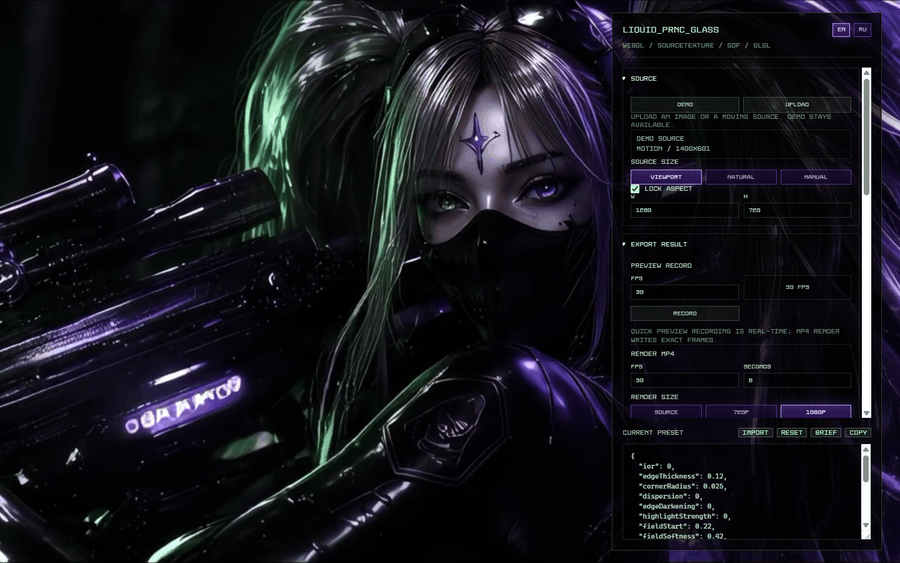
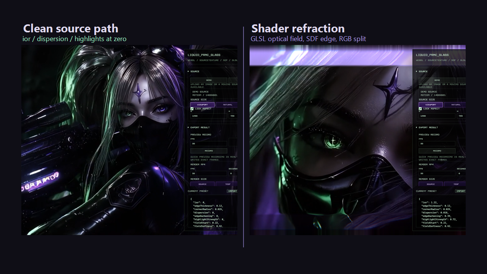
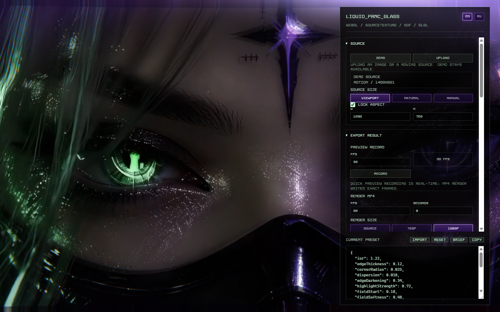
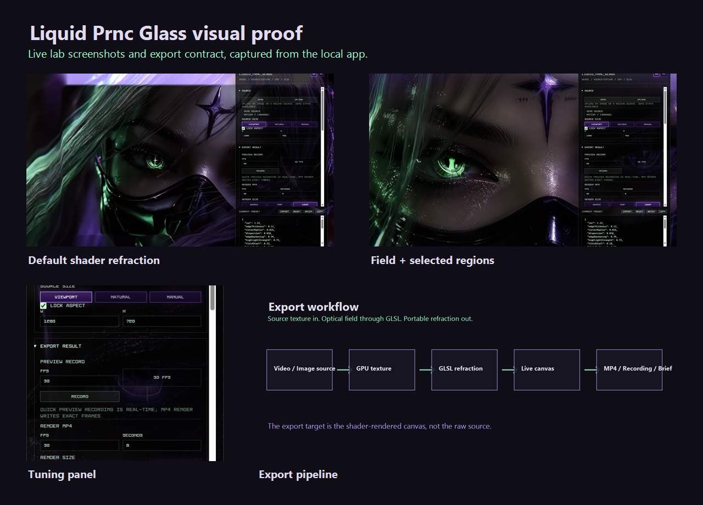
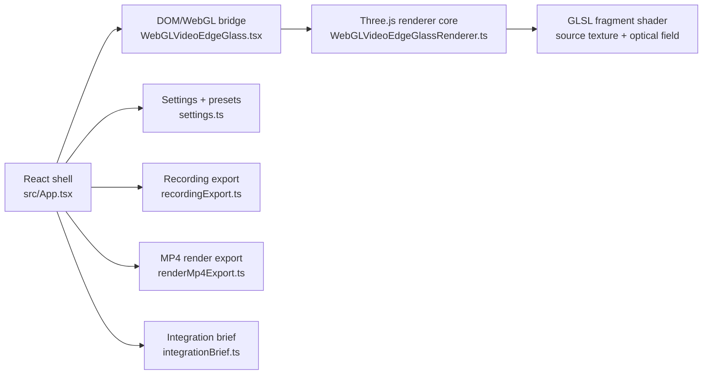
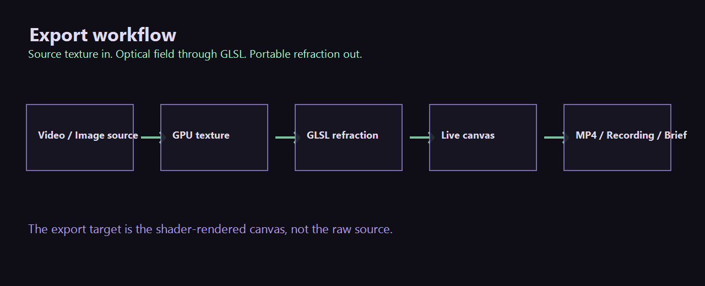

# Liquid Prnc Glass

> Standalone WebGL/GLSL optics lab for reusable edge refraction on video, image, and other visual sources.

[](https://github.com/i4w7w4a/Liquid_Prnc_Glass/actions/workflows/ci.yml)


[GitHub repository](https://github.com/i4w7w4a/Liquid_Prnc_Glass) · [Latest release](https://github.com/i4w7w4a/Liquid_Prnc_Glass/releases/latest)



```text
╭────────────────────────────────────────────╮
│  L I Q U I D   P R N C   G L A S S        │
│  edge refraction / source texture / glsl  │
╰────────────────────────────────────────────╯
```

<div align="center">

<a href="http://liquid-prince.online/">
  
</a>

**[liquid-prince.online](http://liquid-prince.online/)**

`live WebGL optics lab` · `tune the shader` · `export the rendered glass`

</div>

> [!IMPORTANT]
> Liquid Prnc Glass is not CSS glassmorphism, not a blur/filter overlay, and not a landing page shell.
> The optical result is produced by a shader-first WebGL/GLSL renderer pipeline.

## Why This Exists

Liquid Prnc Glass exists to preserve, tune, export, and transfer one reusable visual technique: optical refraction over a real visual source.

The lab takes a video or image, uploads it as a GPU texture through Three.js, and applies a GLSL fragment shader that can keep the center clean while bending light around edges, selected regions, or a smooth center-to-edge field.

It is built as a laboratory, not a product website. The useful question for every change is simple: does this make the glass more convincing, more controllable, more portable, or easier to verify?

## What It Is

- A standalone React + TypeScript + Vite lab.
- A Three.js/WebGL renderer around a GLSL fragment shader.
- A controlled environment for tuning liquid-glass refraction.
- A preset and integration-brief generator.
- A canvas recording and deterministic MP4 render workflow.
- A portable optical effect that can be moved into another project.

## What It Is Not

- Not a CSS blur.
- Not a `backdrop-filter` recipe.
- Not a fake overlay.
- Not a UI kit.
- Not a landing page.
- Not a clone of another liquid-glass demo.

## Quickstart

```bash
npm install
npm run dev
```

Open:

```text
http://127.0.0.1:7474/
```

Run checks:

```bash
npm run test
npm run build
```

Deploy to the configured hosting target:

```bash
npm run deploy:hosting
```

FTP credentials are intentionally stored outside the repository. See [Hosting Deploy](docs/hosting-deploy.md).

## Visual Proof







## Core Architecture



The shader logic belongs in the renderer. React is the shell, not the optical engine.

Key files:

- [`src/App.tsx`](src/App.tsx) holds UI state, sliders, source selection, preset import/export, recording, and render export.
- [`src/liquid-glass/WebGLVideoEdgeGlass.tsx`](src/liquid-glass/WebGLVideoEdgeGlass.tsx) owns the hidden source element, visible canvas, and renderer lifecycle.
- [`src/liquid-glass/WebGLVideoEdgeGlassRenderer.ts`](src/liquid-glass/WebGLVideoEdgeGlassRenderer.ts) owns Three.js, texture creation, shader uniforms, resizing, rendering, and disposal.
- [`src/liquid-glass/settings.ts`](src/liquid-glass/settings.ts) defines the settings contract and preset parser.

## Optical Controls

| Control | Meaning |
|---|---|
| `ior` | Signed refraction strength. `0` must return a clean source. Negative values reverse the direction. |
| `edgeThickness` | Width of the refractive edge band. |
| `cornerRadius` | SDF-style roundness used by the optical boundary. |
| `dispersion` | RGB channel separation along the optical normal. |
| `edgeDarkening` | Absorption/darkening through the glass edge. |
| `highlightStrength` | Rim, lower-lip, and sweep highlight intensity. |
| `fieldStart` / `fieldSoftness` | Clean-center protection and fade width for center-to-edge mode. |
| `fieldCurve` / `fieldStrength` | How the field wakes up and how hard it pulls. |
| `regionTop` / `regionRight` / `regionBottom` / `regionLeft` | Select which edge strips receive the optical effect. |
| `regionWidth` / `regionSoftness` | Width and feathering of selected effect regions. |
| `pixelRatio` | GPU render scale, capped for practical browser use. |

Default preset:

```json
{
  "ior": 1.22,
  "edgeThickness": 0.12,
  "cornerRadius": 0.025,
  "dispersion": 0.018,
  "edgeDarkening": 0.34,
  "highlightStrength": 0.72,
  "fieldStart": 0.22,
  "fieldSoftness": 0.42,
  "fieldFadeMode": 0,
  "fieldCurve": 2.4,
  "fieldStrength": 1,
  "regionTop": true,
  "regionRight": true,
  "regionBottom": true,
  "regionLeft": true,
  "regionWidth": 1,
  "regionSoftness": 0.12,
  "pixelRatio": 2,
  "fieldEnabled": false
}
```

## Export And Portability



The lab exports the shader-rendered result, not the raw source.

- `Record` captures the live WebGL canvas through `canvas.captureStream()` and `MediaRecorder`.
- `Render MP4` builds deterministic frames into a hidden fixed-size WebGL canvas and encodes through WebCodecs/Mediabunny.
- `Brief` generates a Markdown integration handoff with the active preset, shader contract, repository URL, and acceptance checks.

The portable component boundary is:

```tsx
import { WebGLVideoEdgeGlass } from './liquid-glass'
import type { LiquidGlassSettings } from './liquid-glass'

const settings: LiquidGlassSettings = {
  ior: 1.22,
  edgeThickness: 0.12,
  cornerRadius: 0.025,
  dispersion: 0.018,
  edgeDarkening: 0.34,
  highlightStrength: 0.72,
  fieldStart: 0.22,
  fieldSoftness: 0.42,
  fieldFadeMode: 0,
  fieldCurve: 2.4,
  fieldStrength: 1,
  regionTop: true,
  regionRight: true,
  regionBottom: true,
  regionLeft: true,
  regionWidth: 1,
  regionSoftness: 0.12,
  pixelRatio: 2,
  fieldEnabled: false,
}
```

## Documentation Map

- [Overview](docs/overview.md)
- [Architecture](docs/architecture.md)
- [Shader Contract](docs/shader-contract.md)
- [Tuning](docs/tuning.md)
- [Export](docs/export.md)
- [Integration](docs/integration.md)
- [Roadmap](docs/roadmap.md)
- [Release Process](docs/release-process.md)
- [Discussions Guide](docs/discussions.md)
- [Issue Triage](docs/issue-triage.md)
- [Preset Guide](docs/guides/presets.md)
- [Source Regions Guide](docs/guides/source-regions.md)
- [Troubleshooting](docs/guides/troubleshooting.md)
- [Repository Settings Checklist](docs/repository-settings.md)
- [Research Packs](docs/research-packs.md)

Research archives:

- [Liquid Glass Over Video](docs/research/liquid-glass.md)
- [Kube.io Math On WebGL GPU](docs/research/kube-io-math-webgl.md)
- [Source Regions Research](docs/research/source-regions-research.md)

## Development Rules

1. Do not turn the lab into a landing page.
2. Do not replace WebGL/GLSL with CSS blur, filters, or overlays.
3. Keep shader logic in `WebGLVideoEdgeGlassRenderer.ts`.
4. Add new parameters through the full chain:

```text
type/key -> default settings -> control -> uniform -> shader usage -> tests
```

5. `ior = 0` must return a clean source.
6. Negative `ior` must reverse refraction direction.
7. Refraction, dispersion, darkening, and highlights must fade through the shared mask/fade logic.
8. Region selection must affect the optical result, not only the final color.
9. Resize must update resolution and aspect uniforms.
10. Run `npm run test` and `npm run build` before publishing changes.

## Community

- Open a [bug report](.github/ISSUE_TEMPLATE/bug_report.yml) with reproduction steps, environment, GPU/browser details, and preset JSON.
- Open a [feature request](.github/ISSUE_TEMPLATE/feature_request.yml) only when the change improves optical quality, controllability, export, portability, or maintainability.
- Read [CONTRIBUTING.md](CONTRIBUTING.md) before changing renderer behavior.
- Use [CODE_OF_CONDUCT.md](CODE_OF_CONDUCT.md) for collaboration expectations.

## License

Liquid Prnc Glass is released under the [MIT License](LICENSE).

You can use, copy, modify, merge, publish, distribute, sublicense, and sell copies of the software as long as the license notice stays with the software.
