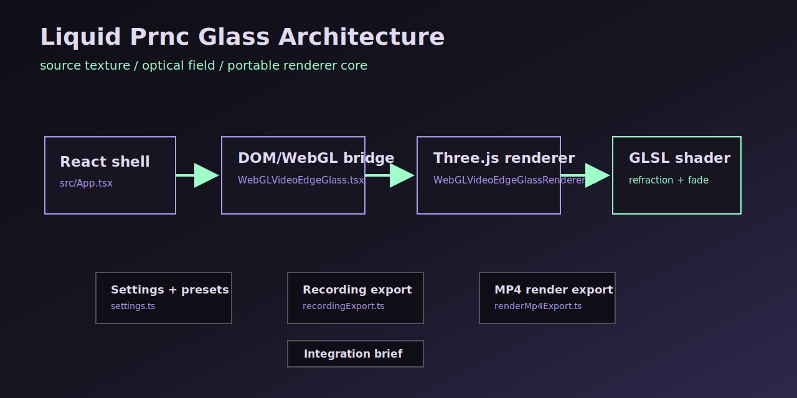

# Architecture

Before changing the renderer, read [Research Packs](research-packs.md) and [Shader Contract](shader-contract.md). The current shader is grounded in [Research: Liquid Glass Over Video](research-liquid-glass.md), and the next profile-library path is stored in [Case Pack 02: Kube.io Math On WebGL GPU](case-kube-io-math-webgl.md).



The project has three layers.

## 1. React Shell

File:

```txt
src/App.tsx
```

Responsibilities:

- holds the current glass settings in React state;
- renders the WebGL preview;
- renders sliders;
- serializes settings to JSON;
- manages source selection;
- controls recording and MP4 render export;
- generates integration handoff text.

Do not put shader logic here. The shell should stay boring.

## 2. React WebGL Bridge

File:

```txt
src/liquid-glass/WebGLVideoEdgeGlass.tsx
```

Responsibilities:

- creates the hidden `<video>` or `` source;
- creates the visible `<canvas>`;
- creates and disposes `WebGLVideoEdgeGlassRenderer`;
- forwards updated settings into the renderer;
- publishes natural source size back to the shell.

This component is the boundary between React and imperative WebGL.

## 3. Three.js Renderer

File:

```txt
src/liquid-glass/WebGLVideoEdgeGlassRenderer.ts
```

Responsibilities:

- creates `THREE.WebGLRenderer`;
- creates `THREE.VideoTexture` or `THREE.Texture`;
- creates `ShaderMaterial`;
- updates uniforms;
- resizes the canvas;
- updates the video texture by `requestVideoFrameCallback` when available;
- disposes GPU resources.

The renderer is the only file that should know about Three.js internals.

## Data Flow

```txt
slider input
  -> React settings state
  -> WebGLVideoEdgeGlass props
  -> renderer.updateSettings()
  -> shader uniforms
  -> next frame renders with new optical values
```

Source data flow:

```txt
video/image source
  -> hidden DOM element
  -> Three.js source texture
  -> GLSL sampler
  -> clean source + optical result
```

## Performance Choices

- `generateMipmaps = false` because dynamic video textures should not rebuild mip chains every frame.
- `LinearFilter` is used for both `minFilter` and `magFilter`.
- `pixelRatio` is exposed as a setting, capped to `3`.
- `powerPreference: 'high-performance'` asks the browser for the stronger GPU path.

## Where To Extend

For new sliders:

1. Add a field to `LiquidGlassSettingKey`.
2. Add a default in `defaultLiquidGlassSettings`.
3. Add a control in `liquidGlassControls`.
4. Add a uniform in `WebGLVideoEdgeGlassRenderer.ts`.
5. Update `updateSettings()`.
6. Use it in the shader.
7. Add tests where the setting touches parsing, normalization, export, or formatting.

Do the steps in that order. If a new slider has no shader uniform, it is decoration.
